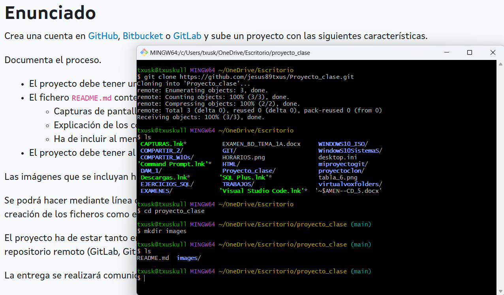
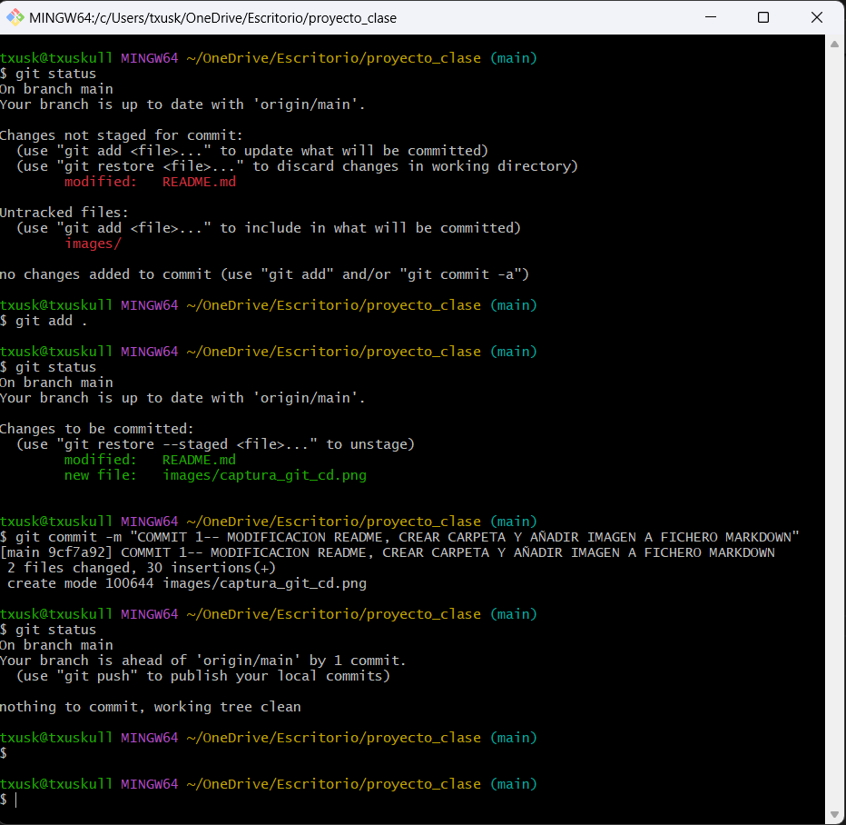
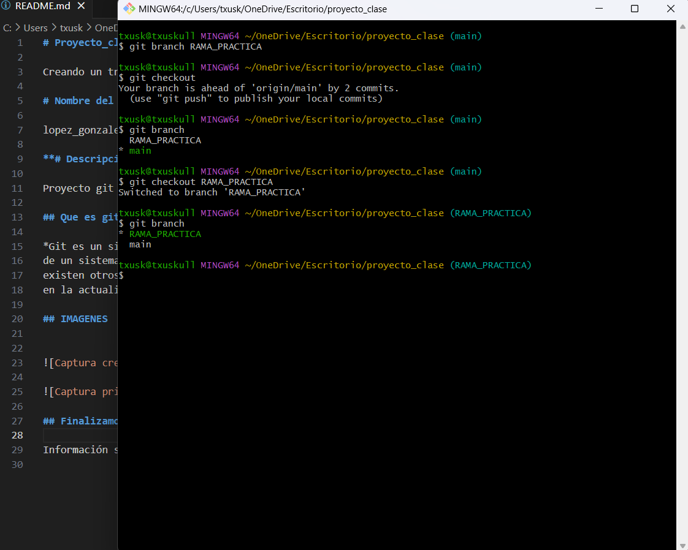
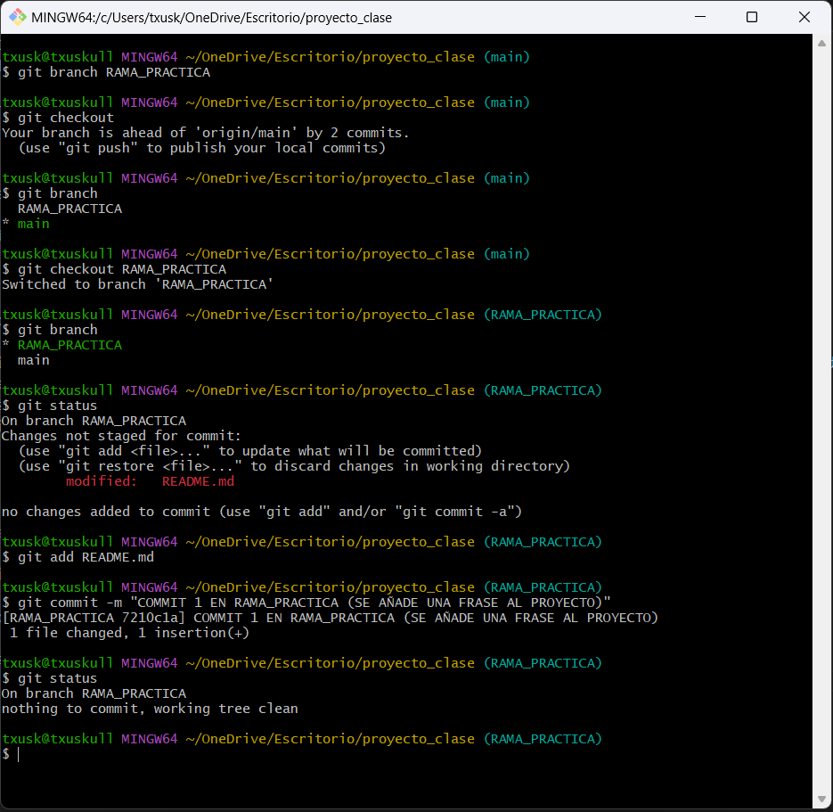
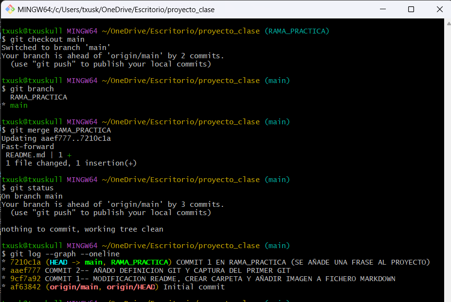

# Proyecto_clase

Creando un trabajo para clase de contornos de desarrollo

# Nombre del Proyecto

lopez_gonzalez_jesus_Tarea_CD05

**# Descripción del proyecto.**

Proyecto git comandos basicos.

## Que es git?

*Git es un sistemas de control de versiones que surgió en el 2005. Su desarrollo surgió a raíz de la necesidad
de un sistema de control de versiones que permitiera gestionar el desarrollo del kernel de Linux. Aunque
existen otros sistemas de control de versiones, Git se ha convertido en uno de los más populares y extendidos
en la actualidad.*

## IMAGENES

## 1

## 2

## 3

## 4

## 5

# ## Trabajos realizados

1__Primero hice una cuenta en github, seguidamente cree mi repositorio.
2__Despues lo clone a mi entorno local y cree la carpeta images con mkdir.
3__Segui trabajando modificando el README.md en mi fichero markdown y añadiendo las capturas que me parecieron oportunas.
4__Tambien ya puesto en materia segui practicando un poco y cree una rama para probar hacer un merge.(Prueba de la rama (añado contenido para hacer un merge).)
5__Cree los commits necesarios para el trabajo y alguno mas para seguir practicando.
6__Y ya por ultimo hago un git push para subir mi trabajo, entrando seguidamente en github para comprobar que esta todo correcto.